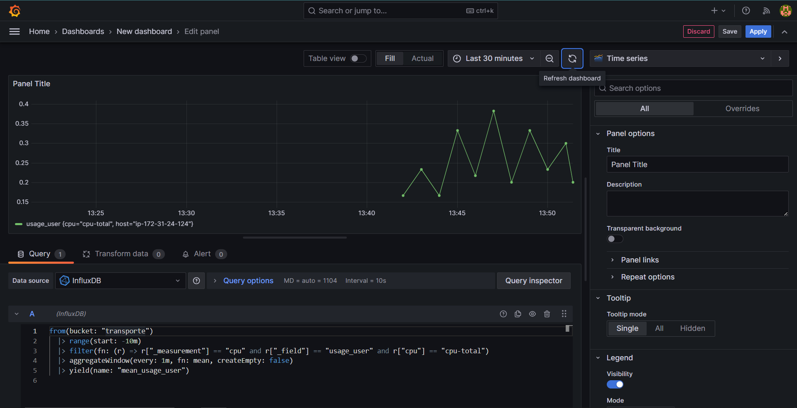
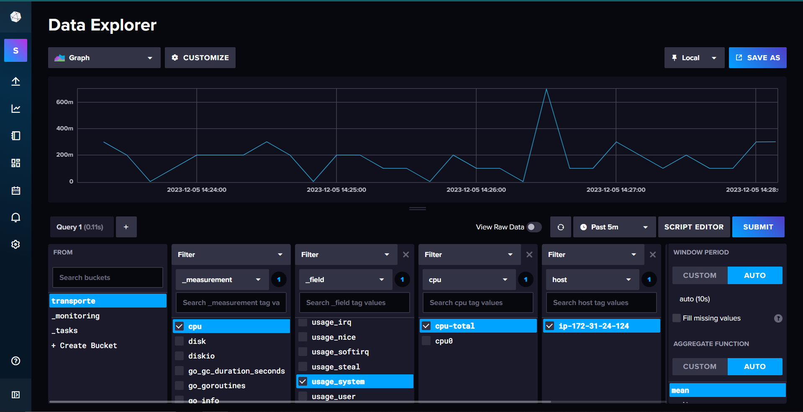

# ProyectoEnEquipo
Entrega Final
# Depto de Sistemas Y computación 
# Ing. En Sistemas Computaconales
# SISTEMAS PROGRAMABLES 

## Integrantes del equipo "Equipo Dinamita"
* AYLIN CASSANDRA PAYAN SAAVEDRA 20212849
* GABRIEL STOYKO MARTINEZ GARCIA 20211808
* EMILIANO GARCIA CORDERO 20211779
* ALEJANDRO JUSTO GARCIA 20212412
* OMAR GARCIA TORRES 20210567
* BRIAN ULISES NAVA VILLAGRANA 19211692
* SAMUEL SALAZAR DIAZ 19211729

# Los Servidores(Capturas)

# Captura del Telegraf-Grafica Influx

# Prometheus

# Seccion de reglas y de alertas

# Consola

# Configuración de Influx

# Promethues.YML

# Simulados Circulo en Wokwi
